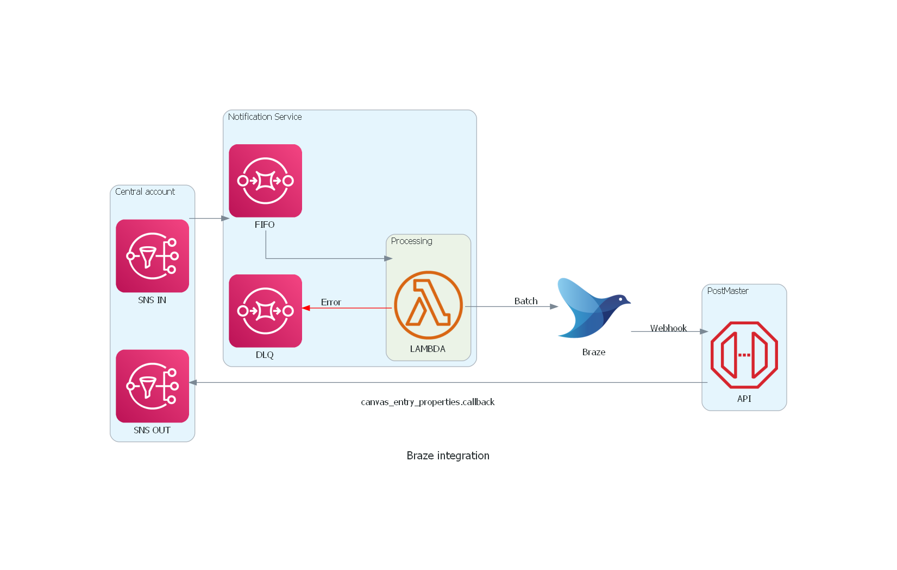

## Installation

It requires **Python 3.6** or higher, check your Python version first.

It uses [Graphviz](https://www.graphviz.org/) to render the diagram, so you need to [install Graphviz](https://graphviz.gitlab.io/download/) to use **diagrams**. After installing graphviz (or already have it), install the **diagrams**.

> macOS users can download the Graphviz via `brew install graphviz` if you're using [Homebrew](https://brew.sh).

```shell
$ pip install diagrams
```


## Example for Braze integration

Notification service v2 and Postmaster




More exemple could be found here: https://diagrams.mingrammer.com/
